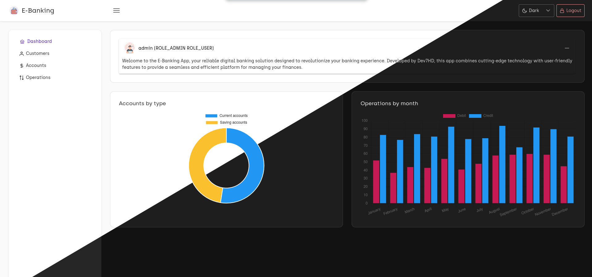

# E-Banking-App 🌐💳

E-Banking-App is a modern online banking application built with Angular. This project aims to provide essential banking services through a user-friendly interface.


## Features ✨

- **User Authentication**: Secure login and registration using JWT.
- **Account Management**: View and manage account details, balance, and transactions.
- **Transaction Management**: Perform fund transfers and view transaction history.
- **Admin Panel**: Manage users and view system logs.
- **Responsive Design**: Optimized for various devices.

## Technologies Used 🛠️

- **Frontend**: Angular
- **Authentication**: JWT

## Installation 🚀

### Prerequisites 📋

- Node.js and npm
- Angular CLI

### Steps 🔧

1. **Clone the repository**
    ```bash
    git clone 
    cd E-Banking-App
    ```

2. **Frontend Setup**
    - Navigate to the project directory
    - Install the required dependencies
    ```bash
    npm install
    ```
    - Start the frontend server
    ```bash
    ng serve
    ```

## Usage 💡

Once the frontend server is running, you can access the application at `http://localhost:4200`.

### API Endpoints 🔗

- **User Authentication**
  - `POST /auth/login`: Authenticate a user

- **Account Management**
  - `GET /accounts`: Retrieve user accounts

- **Customer Management**
  - `GET /customers`: Retrieve user accounts

- **Transaction Management**
  - `GET /operations`: Retrieve operations history

## Project Structure 📁

### Frontend (Angular)
- **`src/app`**: Contains the main application code
  - **`layout`**: Layout components (sidebar, topbar, etc.)
  - **`services`**: Angular services for API calls
  - **`models`**: Data models
  - **`accounnts`**: View and manage accounts
  - **`customers`**: View and manage customers
  - **`operations`**: View and manage operations
  - **`admin`**: Contain admin components as children
  - **`account-history`**: View an account history
  - **`customer-accounts`**: View and manage a customer accounts
  - **`guards`**: Project guards
  - **`interceptors`**: Project interceptors
  - **`login`**: User login
  - **`not-auth`**: Not authenticated page
  - **`notfound`**: Not found page
## Screenshots


## Contributing 🤝

Contributions are welcome! Please follow these steps to contribute:

1. Fork the repository
2. Create a new branch (`git checkout -b feature-branch`)
3. Commit your changes (`git commit -am 'Add new feature'`)
4. Push to the branch (`git push origin feature-branch`)
5. Create a new Pull Request


